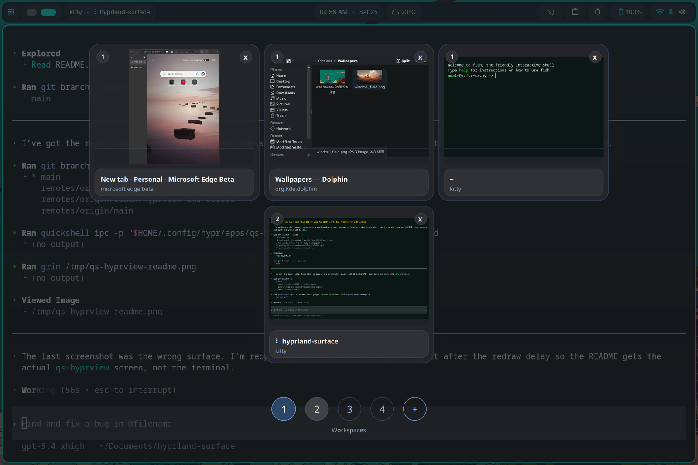

# hyprland-surface

Packaged Surface Pro 7 Hyprland tablet setup around Dank Material Shell.

## Overview

`qs-hyprview` is the packaged recent-apps overview. It shows open windows
across workspaces, supports drag-to-workspace moves, and follows the active DMS
palette through the bundled `matugen` template.



## Layout

```text
packages/
  surface-dms/      DMS plugin with Back, Keyboard Toggle, and Recent Apps
  qs-hyprview/      Quickshell recent-apps overview
  wvkbd/            Patched wvkbd source, scripts, and Fcitx integration files
  hypr/             Hyprland config snapshot
  sddm/             SDDM silent-theme tablet config
systemd/user/       User services for wvkbd and the Fcitx focus watcher
docs/               Notes and troubleshooting
install.sh          Installs the packaged setup into the live config paths
uninstall.sh        Removes app packages and user services
scripts/            Per-component install and uninstall helpers
```

## Dependencies

Install the required packages first:

```bash
sudo pacman -S --needed \
  sddm qt5-virtualkeyboard \
  fcitx5 fcitx5-gtk fcitx5-qt fcitx5-configtool \
  git cmake base-devel rsync jq \
  quickshell uwsm
```

Install these separately before using the packaged Hypr config:

- `iio-hyprland`
- Dank Material Shell, using the official DMS install method
- `linux-surface`, if this is a Surface device

Install these only if you want the matching integration:

- [`hyprgrass`](https://github.com/horriblename/hyprgrass), for the packaged
  gesture binding that opens recent apps
- `sddm-silent-theme`, for the packaged SDDM theme files

## Install

Use the per-component scripts you need from the repo root:

```bash
./scripts/install-wvkbd.sh
./scripts/install-qs-hyprview.sh
./scripts/install-surface-dms.sh
./scripts/install-hypr-config.sh
```

Component scope:

- `install-wvkbd.sh`: deploys `packages/wvkbd`, installs Fcitx integration
  files, builds the custom binary, and enables `wvkbd.service` plus
  `fcitx-wvkbd-auto.service`
- `install-qs-hyprview.sh`: deploys `packages/qs-hyprview` and enables
  `qs-hyprview.service`, and registers the repo's `matugen` template so DMS can
  generate `qs-hyprview/theme.json` on theme and wallpaper changes
- `install-surface-dms.sh`: deploys the DMS plugin and restarts DMS if present
- `install-hypr-config.sh`: merges the packaged Hyprland config into
  `~/.config/hypr`

## Install Everything

If you want the previous all-in-one behavior:

```bash
./install.sh
```

The full installer runs the component scripts above.

Installed paths:

- `packages/wvkbd` to `~/.config/hypr/apps/wvkbd`
- `packages/qs-hyprview` to `~/.config/hypr/apps/qs-hyprview`
- `packages/surface-dms` to `~/.config/DankMaterialShell/plugins/surface-dms`
- `packages/hypr` to `~/.config/hypr`
- Fcitx environment and virtual keyboard config files to `~/.config`
- user services to `~/.config/systemd/user`

For `packages/wvkbd`, `packages/qs-hyprview`, and `packages/surface-dms`, the
installer uses `rsync --delete`. Re-running `./install.sh` replaces the
deployed copies in `~/.config` with the versions from this repo.

It also builds the custom `wvkbd` binary and enables:

- `qs-hyprview.service`
- `wvkbd.service`
- `fcitx-wvkbd-auto.service`

The packaged Hypr config starts DMS, Fcitx, and `iio-hyprland`. If `hyprgrass`
is installed, the packaged gesture binding opens recent apps through
`quickshell ipc`. `install-qs-hyprview.sh` also registers a `matugen` template
for `~/.config/hypr/apps/qs-hyprview/theme.json`, so the overview can follow
the active DMS palette without reading Hyprland config. The custom keyboard
itself is owned by `wvkbd.service`, not by a Hypr `exec-once` line.

Example [`hyprgrass`](https://github.com/horriblename/hyprgrass) binding for
swipe up from the bottom edge:

```ini
hyprgrass-bind = , edge:d:u, exec, quickshell ipc -p ~/.config/hypr/apps/qs-hyprview call expose open smartgrid
```

If this is the first time installing the Fcitx environment files, restart the
user session after installation.

## DMS Plugin

After install:

1. Open DMS settings.
2. Go to `Plugins`.
3. Click `Scan for Plugins`.
4. Enable `Surface Tablet Controls`.
5. Open its settings and click `Create Missing Default Variants`.
6. Add the variants you want in DankBar settings.

Recommended variants:

- `Recent Apps`
- `Keyboard Toggle`
- `Back`

## Keyboard Model

`wvkbd` starts hidden. Fcitx focus drives show/hide through
`fcitx-wvkbd-auto.service`, which watches Fcitx input-context focus and calls
the existing `show-wvkbd.sh` and `hide-wvkbd.sh` scripts.

The DMS keyboard button only switches between two user states:

- auto mode: clears the disabled flag, starts the watcher, and force-shows once
- disabled mode: stops the watcher, hides the keyboard, and blocks show requests

Icon state is based on files in `/run/user/$UID/wvkbd-custom`:

- no flag: `keyboard`
- `visible`: `keyboard_hide`
- `disabled`: `keyboard_off`

## SDDM

SDDM files are packaged but not installed automatically because they write to
system paths. Install them manually:

```bash
sudo cp packages/sddm/sddm.conf /etc/sddm.conf
sudo install -d -m 0755 /usr/share/sddm/themes/silent/configs
sudo cp packages/sddm/metadata.desktop /usr/share/sddm/themes/silent/metadata.desktop
sudo cp packages/sddm/catppuccin-mocha-tablet.conf /usr/share/sddm/themes/silent/configs/catppuccin-mocha-tablet.conf
```

## Verify

```bash
systemctl --user status qs-hyprview.service --no-pager
systemctl --user status wvkbd.service --no-pager
systemctl --user status fcitx-wvkbd-auto.service --no-pager
pgrep -af 'fcitx5|wvkbd-deskintl-custom|fcitx-wvkbd-auto|quickshell|dms'
dms ipc plugins status surfaceTabletControls
```

## Uninstall

```bash
./uninstall.sh
```

The full uninstaller removes the packaged apps and user services. It
intentionally leaves Hyprland config, Fcitx config, DMS settings, and SDDM
system files in place.

For selective removal:

```bash
./scripts/uninstall-wvkbd.sh
./scripts/uninstall-qs-hyprview.sh
./scripts/uninstall-surface-dms.sh
```
